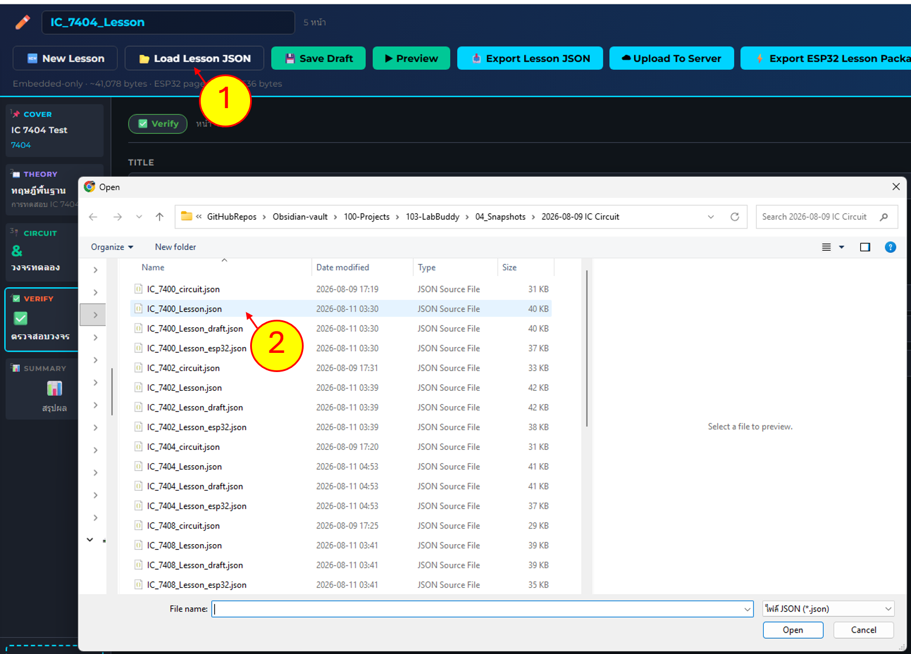
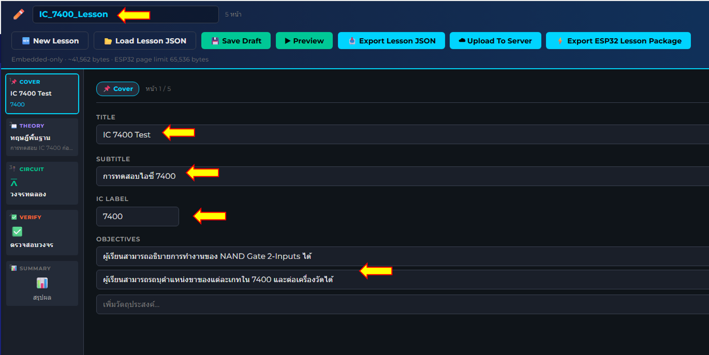
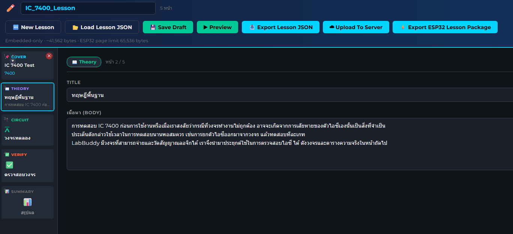
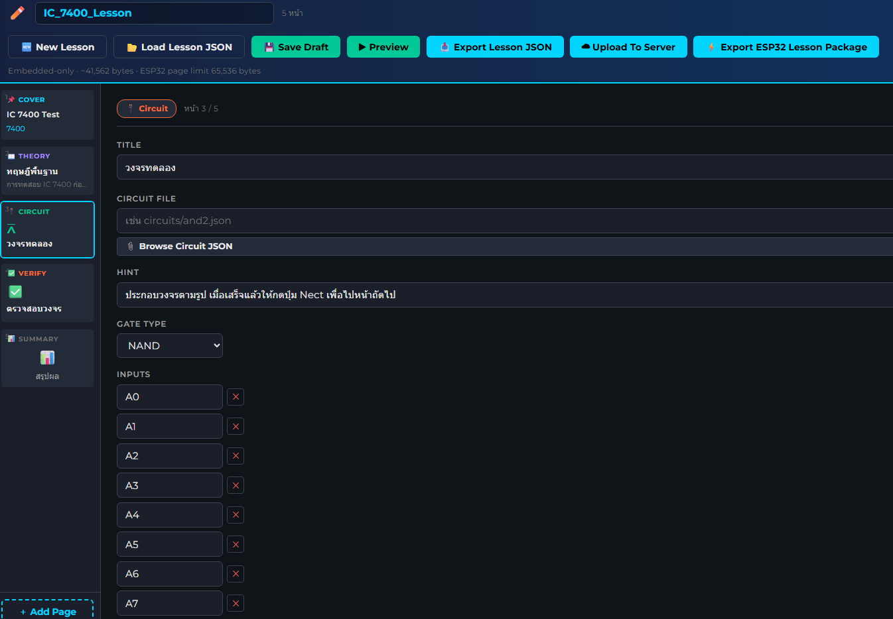
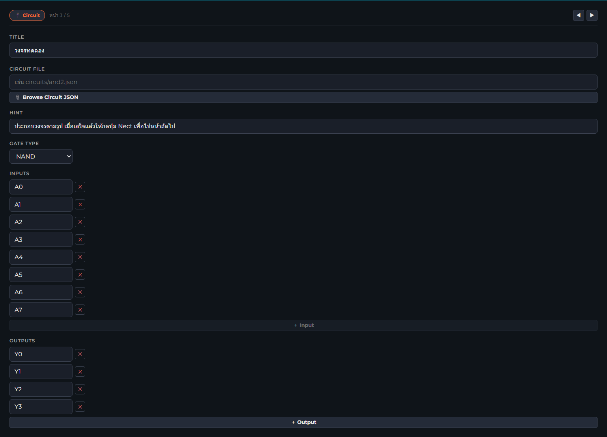
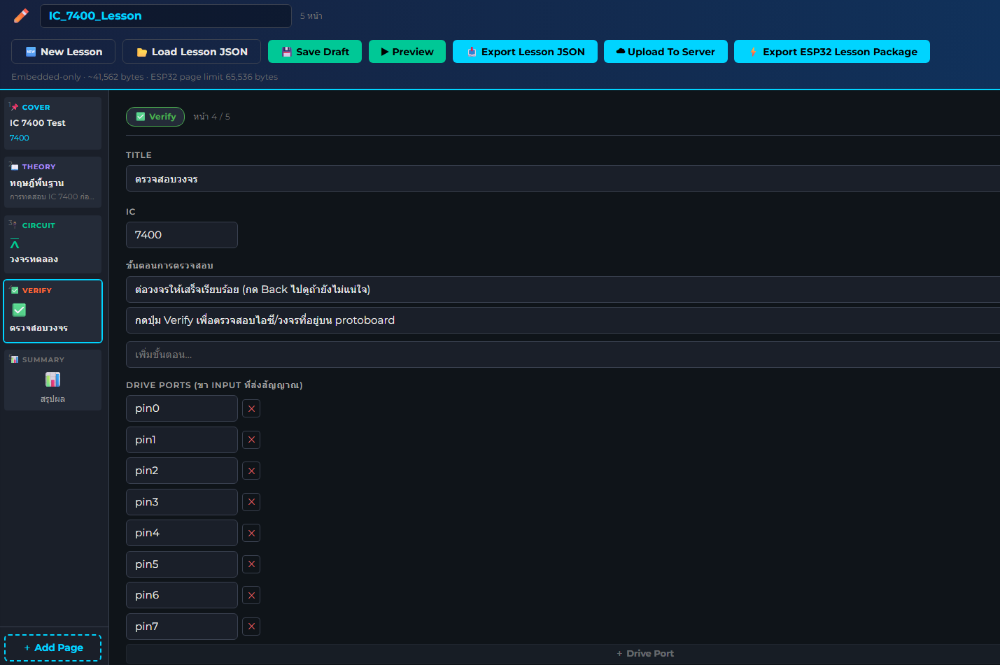
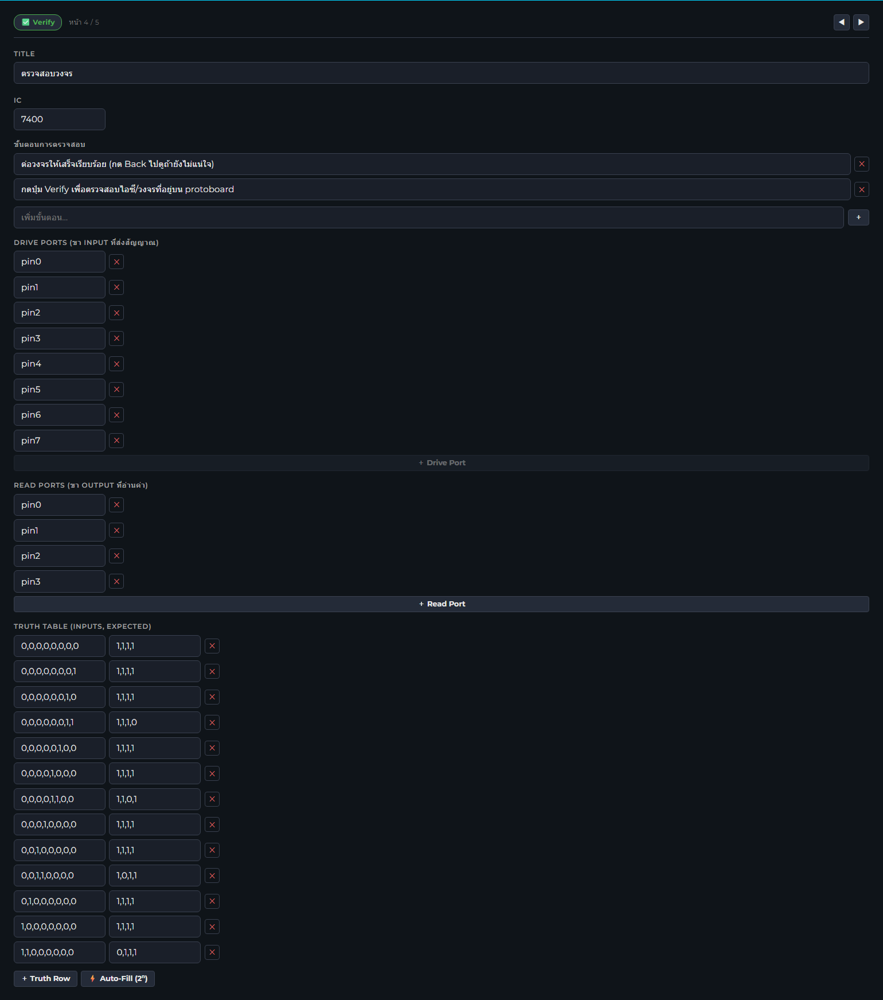
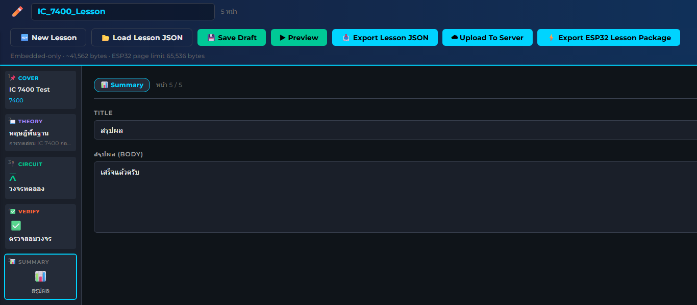

# ลำดับงาน

1. Fork repo นี้
2. Clone ไปที่เครื่อง
3. เปิดไฟล์ ในโฟลเดอร์ IC-Test ด้วย Lesson Authoring 

http://172.104.42.221:5050/lesson-editor

	เช่น IC_7404_Lesson

1. ตรวจสอบชื่อไฟล์และองค์ประกอบในหน้า COVER

5. ตรวจสอบองค์ประกอบและรายละเอียดในหน้า THEORY

6. ตรวจสอบองค์ประกอบและรายละเอียดในหน้า CIRCUIT

6.1 เช็คจำนวน port  ว่าตรงไหม เช่น AND gate 2-inputs จำนวน 4 ตัว ต้องมี  INPUT = 8, OUTPUT = 4 

 

7. ตรวจสอบหน้า verify 

7.1 วิเคราะห์ truth table  สำหรับการตรวจสอบไอซี
หมายเหตุ ในขั้นนี้ เราจะตรวจสอบเฉพาะลอจิกที่ไม่ซ้ำกันและให้ผลการวัดเพื่อตรวจสอบเท่านั้น ไม่ได้ทดสอบทั้งหมด 

8. ตรวจสอบหน้า SUMMARY

ตรวจให้ครบทุกใบงาน แล้วใส่ผลไว้ใน  [Issues #1](https://github.com/Lab-Happy/LabBuddy-Lesson/issues/1)